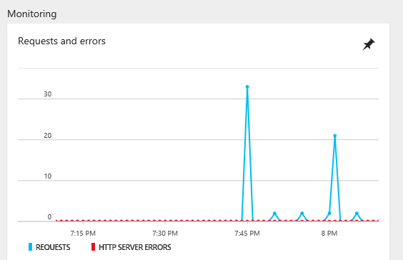

# Create and deploy a Java app to Azure with Maven

This quickstart helps you create and deploy a simple Java web app to [Azure App Service](/azure/app-service/app-service-value-prop-what-is) in just a few minutes using [Apache Maven](http://maven.apache.org) and the Azure CLI.

## Before you begin

Before you start, set up the following:

- [Git](https://git-scm.com/)
- [Java 8](https://packages.ubuntu.com/xenial/java/default-jre)
- [Maven 3](http://maven.apache.org/download.cgi)
- [Azure CLI 2.0](https://docs.microsoft.com/cli/azure/install-az-cli2)

If you don't have an Azure subscription, create a [free account](https://azure.microsoft.com/free/?WT.mc_id=A261C142F) before you begin.

## Get the sample code

Clone the sample app repository to your local machine. The sample is a simple JSP application with additional Maven configuration in the project `pom.xml` to test the app locally and help deploy the sample to Azure App Service.

```
git clone https://github.com/Azure-Samples/app-service-maven
```

## Run the app locally

Open a command prompt and use Maven to build the app and run it in a local [Tomcat](https://tomcat.apache.org) web container. 

```
cd app-service-maven
mvn package
mvn tomcat7:run-war
```

Open a web browser and navigate to http://localhost:8080 to preview the app:

  

## Log in to Azure

Log in to the Azure CLI with `az login`. This quickstart uses the CLI to query and create the Azure resources needed to host the app.
   
```azurecli
az login
```

## Create a resource group   

Create a resource group with [az group create](/cli/azure/group#create). An Azure resource group is a logical container into which Azure resources are deployed and managed.

```azurecli
az group create --location "East US" --name myResourceGroup
```

To see other possible values you can use for `---location`, use [az appservice list-locations](/cli/azure/appservice#list-locations)

## Create an App Service plan

Create a **FREE** [App Service plan](/azure/app-service/azure-web-sites-web-hosting-plans-in-depth-overview) using [az appservice plan create](/cli/azure/appservice/plan#create). App Service plans allocate resources shared across all web apps running in the plan.


```azurecli
az appservice plan create --name my-free-appservice-plan --resource-group myResourceGroup --sku FREE
```

When the App Service Plan is ready, the Azure CLI shows information similar to the following example:

```json
{
    "id": "/subscriptions/00000000-0000-0000-0000-000000000000/resourceGroups/myResourceGroup/providers/Microsoft.Web/serverfarms/my-free-appservice-plan",
    "location": "East US",
    "sku": {
    "capacity": 1,
    "family": "S",
    "name": "S1",
    "tier": "Standard"
    },
    "status": "Ready",
    "type": "Microsoft.Web/serverfarms"
}
```


## Create a web app

Create a web app that uses the plan's resources using the Azure CLI [az webapp create](/cli/azure/appservice/web#create) command. The web app definition provides a space to deploy the code to and a URL to access the app once it's running.

In the command below substitute your own unique app name where you see the <appname> placeholder. The <appname> is used in the default hostname for the web app. If <appname> is not unique, you get the friendly error message "Website with given name already exists."

```azurecli
az webapp create --name appname --resource-group myResourceGroup --plan my-free-appservice-plan
```

When the Web App has been created, the Azure CLI shows information similar to the following example.1

```json
{
    "clientAffinityEnabled": true,
    "defaultHostName": "<appname>.azurewebsites.net",
    "id": "/subscriptions/00000000-0000-0000-0000-000000000000/resourceGroups/myResourceGroup/providers/Microsoft.Web/sites/<appname>",
    "isDefaultContainer": null,
    "kind": "app",
    "location": "East US",
    "name": "<app_name>",
    "repositorySiteName": "<app_name>",
    "reserved": true,
    "resourceGroup": "myResourceGroup",
    "serverFarmId": "/subscriptions/00000000-0000-0000-0000-000000000000/resourceGroups/myResourceGroup/providers/Microsoft.Web/serverfarms/my-free-appservice-plan",
    "state": "Running",
    "type": "Microsoft.Web/sites",
}
```

## Configure Java and Tomcat

Configure the web app to use Java and Tomcat using the Azure CLI's [az webapp config](/cli/azure/appservice/web#config) command. The example below configures App Service to run Java 8 and [Apache Tomcat 8.5](http://tomcat.apache.org/) to run the app.

```azurecli
az webapp config set \ 
--name appname \
--resource-group myResourceGroup \
--java-container TOMCAT \
--java-version 1.8.0_73  \
--java-container-version 8.5
```

## Configure Maven 

The sample's Maven `pom.xml` includes configuration to FTP the sample into Azure, but you'll need to customize it to deploy to your own web app. Retreive your App Seevice credentials with [az appservice web deployment list-publishing-profiles](/cli/azure/appservice/web/deployment#list-publishing-profiles):

```azurecli
az webapp deployment list-publishing-profiles  \
--name appname \ 
--resource-group myResourceGroup  \
--query "[?publishMethod=='FTP'].{URL:publishUrl, Username:userName,Password:userPWD}" 
```

```json
[
  {
    "Password": "aBcDeFgHiJkLmNoPqRsTuVwXyZ",
    "URL": "ftp://waws-prod-blu-045.ftp.azurewebsites.windows.net/site/wwwroot",
    "Username": "appname\\$appname"
  }
]
```

Replace the placeholders in the `az-settings.xml` file with password, username, and FTP hostname from the output. Make sure to only use one `\` character in the username instead of the escaped value from the CLI output.
   
```XML
...
    <server>
      <id>azure-hello-world</id>
      <username>appname\$appname</username>
      <password>aBcDeFgHiJkLmNoPqRsTuVwXyZ</password>
    </server>
...
   <configuration>
     <fromFile>${basedir}/target/AzureAppDemo-0.0.1-SNAPSHOT.war</fromFile>
     <url>ftp://waws-prod-blu-045.ftp.azurewebsites.windows.net/site/wwwroot</url>
     <toFile>webapps/ROOT.war</toFile>
     <serverId>azure-hello-world</serverId>
   </configuration>
...
```

## Deploy the sample application

Deploy with sample to Azure, using Maven's `-s` parameter to use the configuration in the `az-settings.xml` file.

```
mvn install -s az-settings.xml
```

## Browse to web app

View the sample running in Azure:

```azurecli
az webapp browse --name appname --resource-group myResourceGroup
```

## Update the app

Using a text editor, open `src/main/webapp/index.jsp`, and replace the existing JSP with the one below.

```html
<%--
  Copyright (c) Microsoft Corporation. All rights reserved.
  Licensed under the MIT License. See License.txt in the project root for
  license information.
--%>
<%@ page contentType="text/html;charset=UTF-8" language="java"  import="java.util.Date" %>
<html>
<head>
  <title>Azure Samples Hello World</title>
</head>
<body>
  <H1>Hello Azure!</H1>
   Current time is: <%= new Date() %>
</body>
</html>
```

Deploy the update with Maven:

```
mvn clean package
mvn install -s az-settings.xml
```

Refresh your browser after the app redeploys to view your changes.

## Manage your new Azure app

Go to the Azure portal to take a look at the web app you just created.

To do this, sign in to [https://portal.azure.com](https://portal.azure.com).

From the left menu, click **App Service**, then click the name of your Azure web app.

 

Test the monitoring by running `curl` against the app to send some traffic.

```bash
curl http://<appname>.azurewebsites.net/?[1-30]
```

You'll see the request activity in the monitoring after a couple of minutes.

 

## Clean up resources

To remove all the resources created in this guide, run the following command:

```azurecli
az group delete --name myResrouceGroup
```

## Next steps

Browse the full list of [Azure Java samples](https://azure.microsoft.com/resources/samples/?term=java).